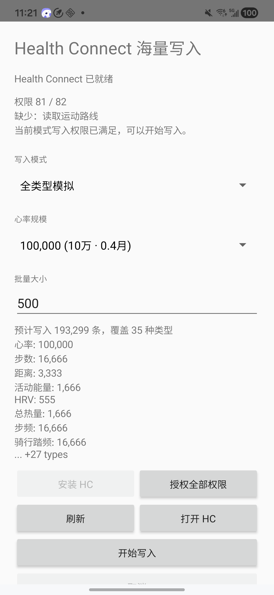

# Health Connect 海量写入

一个用于测试 Google Health Connect 海量数据写入的 Android 工具应用。

这个项目主要用于向 Health Connect 批量写入模拟健康数据，方便验证健康类应用在大数据量下的读取、同步、缓存和页面性能表现。

## 功能

- 申请当前设备支持的 Health Connect 读写权限。
- 支持两种写入模式：
  - `核心压测`：写入心率、步数、距离、活动能量、HRV 等核心高频数据。
  - `全类型模拟`：为应用覆盖的 Health Connect 记录类型生成模拟数据。
- 以心率条数作为规模基准：
  - 心率按 10 秒一条生成。
  - 其他类型按各自采样间隔自动派生写入数量。
- 支持设置批量大小，分批调用 `HealthConnectClient.insertRecords()` 写入。
- 支持进度显示、取消写入、缺失权限提示。
- 当缺少非写入权限时，不阻塞当前模式的写入；只有缺少当前模式需要的写入权限时才会禁止开始。

## 示例

## 使用说明

1. 在 Android 设备上安装并打开应用。
2. 如果 Health Connect 不可用，先安装或更新 Health Connect。
3. 点击 `授权全部权限`，授予 Health Connect 权限。
4. 选择写入模式、心率规模和批量大小。
5. 点击 `开始写入`，等待批量写入完成。

## 注意事项

- 这是测试工具，会向 Health Connect 写入大量模拟数据。
- 建议只在测试设备、模拟器或可清理数据的环境中使用。
- Health Connect 可能会因设备版本、功能开关或权限状态而跳过部分记录类型。
- 写入量越大，耗时越长，也更容易触发目标应用的性能瓶颈。

## 开源协议

MIT
